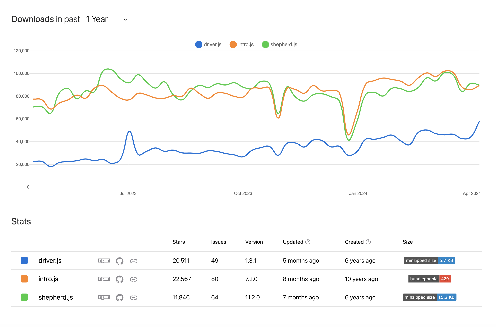

Hey there, it’s me Chuck Carpenter. Today I want to talk about Shepherd.js, the open source library and to announce Shepherd Pro, a way to take things further to create user journeys that are informed and effective. The TL;DR is:

- An alpha launch of the Pro platform and adding analytics capabilities to the library
- Chuck is building the Pro product, with continued support and help from Robbie and the OS community for the library
- Sign up today at https://shepherdpro.com
- Everything remains open source, MIT licensed, and we are looking for feedback on the product to help us drive things forward

As many of you know, I’ve been a maintainer of the Shepherd library for about 7 years or so. What originally started as an Ember.js add-on of an existing tour library, has been rewritten a number of times and morphed into one of the most popular user journey libraries (thanks to our 90+ contributors) with almost 12k stars! We now believe our users are looking for more while supporting the ethos of open source (we are committed to keeping the library OSS).

We’ve worked to make software that is stable, accessible, and very composable in order to allow developers to create some clever ways to help their users find functionality and value for their time (companies and projects such as Drupal, Google, and recently our friends at Codepen.io). Much of that work has also allowed us to learn a lot about maintaining/publishing dependencies and work through a few interesting patterns such as attaching an element to another, highlighting it, and programmatically reacting to user events.

Today, we’re excited to announce the alpha release of Shepherd Pro, a robust new addition to our trusted Shepherd library. Shepherd has gained and maintained popularity for its openness and expandability, and now we’re dialing it up by integrating powerful analytics capabilities. While there exists paid software where you can create onboarding tours for your application, they seem to be very focused on WYSIWYG creation and customization. Our users are very technical and are able to control all these things quite comfortably in code. Why not empower them to and give them a professional product that allows them to bring in feedback and data? These new features will transform how you understand and improve user interactions throughout their journeys.

With Shepherd Pro, you’ll have deep insights into how users interact with your guided journeys. Our new analytics tools allow you to track user engagement step-by-step, pinpointing exactly where users might disengage or need extra help. This data isn’t just informative—it’s crucial for enhancing the effectiveness of each journey and identifying areas for improvement.

While other tools exist in the market to address some of these areas, we feel that a completely open source approach that allows end product users to not only provide valuable insights but also actively contribute is critical in our path to deliver the most impactful solutions. Additionally, there are features that aren't available in other products such as:

On premise/self hosted solutions
Accessibility focus
Catering to highly technical and high performing engineering teams

The ultimate goal? To make your tours not only more engaging but also easier to navigate, boosting product adoption and user satisfaction. We aim to get users to the "aha!" moment of your application more smoothly and quickly, because a well-informed user is a happy user. Integrations extend beyond just our own tools as well. Now, Shepherd Pro easily connects with top analytics platforms like Posthog, with more integrations on the horizon. This seamless connection ensures that you can manage and analyze your user journey data effortlessly within a familiar environment.

We’re thrilled to see how Shepherd Pro will empower you to craft even more engaging and effective user journeys and we’re launching all of this to alpha users under our open source project that is MIT licensed. As we progress toward the next stages of release, we plan to add targeting options, allow you to sync your cohorts from our integrations, and eventually add ways to more easily define the configurations of a journey. Join us at [https://shepherdpro.com](https://shepherdpro.com) to sign up or feel free to reach out to me directly, [hello@shepherdpro.com](mailto:hello@shepherdpro.com).
